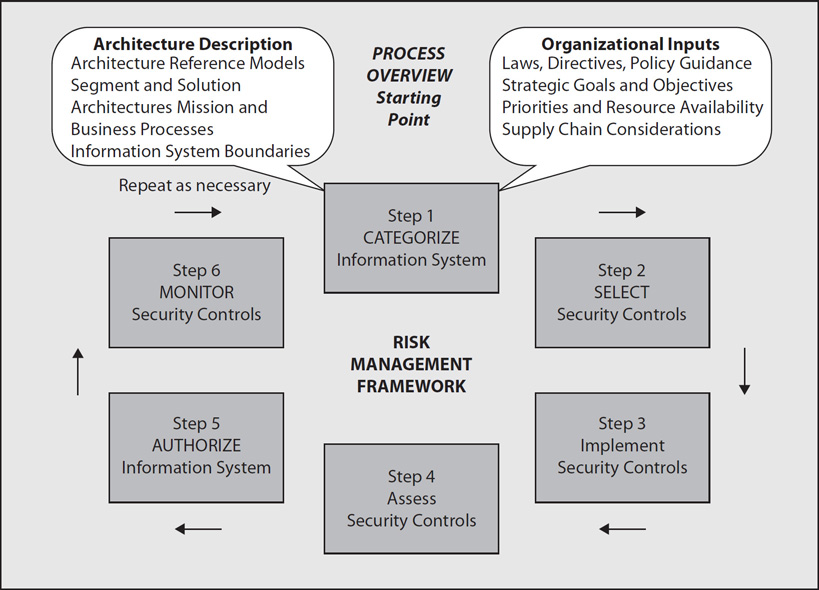
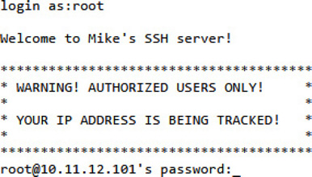
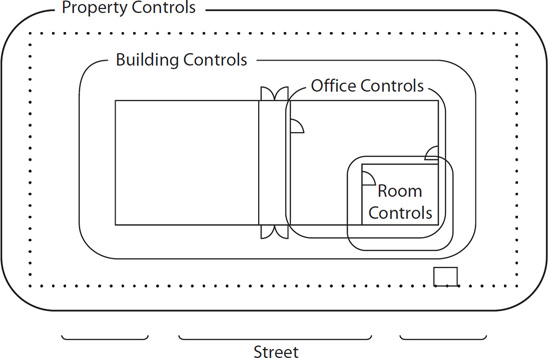
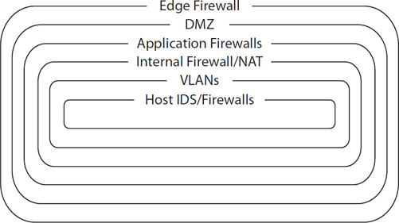
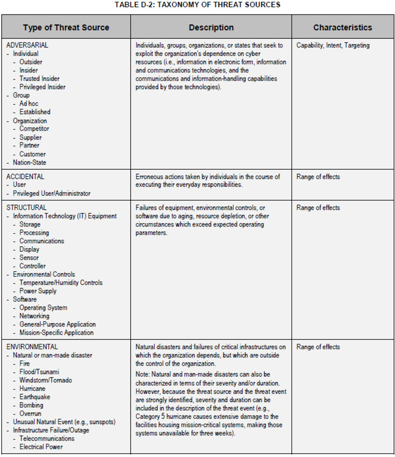

# Sec+ lunch & learn

I am reading through Mike Meyer's Sec+ certification guide, and will provide a condensed summary of the material.

Security's job is not to say no. That would be easy, (abstinence is the best policy)
we can just disconnect the company's infrastructure from the internet and call it a day.

Security's job is to perform risk anaylsis and make concessions where applicable. Part of it involves destroying the economics of attacking the infrastructure. Read Time based security.

WAFs are bullshit and don't work. You can do 1 http GET request per ip, per page, and change it each time.

99.9% of http attacks are automated. You should not be attempting to detect attacks, but rather automation.

## Chapter 1 Risk Management

Risk management is the science of identifying and categorizing risks and then systematically applying resources to these risks to minimize their impact on an organization.
Risk is the probability of a threat actor taking advantage of a vulnerability by using a threat against an IT system asset. The follow concepts are used to deduce risk.

### Module 1-1: Defining Risk

#### Asset

Things like servers, applications, data and even personnel.

#### Probability

Probability means the likelihood—over a defined period of time—of someone or something damaging assets.

#### Threat Actor

Hacktivists, Script kiddies, Insiders, Competitors, Organized crime, Nation state/APT. There is also the possibility of unintended insider threats such as employees deleting a DB,
so unnecesarily elevated permissions can be viewed as a vulnerability.

#### Vulnerability and Threat

The terms vulnerability and threat go hand-in-hand, so it makes sense to talk about both at the same time. A vulnerability is a weakness inherent in an asset that leaves it open to a threat. A threat is an action a threat actor can use against a vulnerability to create a negative effect. You can’t have a threat without a vulnerability. Not changing the default password on a router is a vulnerability; someone taking control of your router by using the default password is the threat.

#### The Risk “Formula”

Risk = Probability × Vulnerability × Threat.  Impact is the effect of an attack on a single asset. Impact is measured in different ways, such as financial (value, repair), life (as in human lives), and reputation (good will, mentioned earlier).

Risk of meteor threat = (very low probability) × (high impact)

Given the very low likelihood of a meteor impact, you won’t try to reduce your vulnerability to this threat

Risk = Probability × Impact

Malware from e-mail is a huge problem, but generally not very hard to clean up, so:

Risk of malware through e-mail = (very high probability) × (moderate impact)

### Module 1-2: Risk Management Concepts

#### Infrastructure

In IT risk management, the term infrastructure applies to just about every aspect of an organization, from the organization itself to its computers, networks, employees, physical security, and sometimes third-party access.

* Organization: At its most basic, an organization is who you work for: your company, your corporation, your non-profit, your governmental department, your team.
* Systems: People matter, such as IT managers, IT techs, human resources, governance (chief security officer, chief information officer), and legal staff; even individual users are part of the IT infrastructure.
* Physical Security: Fences, cameras, and guards protect your infrastructure just as well as they protect the rest of your organization.
* Third-Party Access: Third parties that your organization contracts with are part of your IT infrastructure.

#### Security Controls

A security control is a directed action you place on some part of your infrastructure. Account password complexity enforcement is a security control.

#### Risk Management Framework

Easily the most popular RMF available comes from the National Institute of Standards and Technology (NIST). Other considerations for your risk management framework
are Laws such as HIPAA and GDPR, and Standards such as PCI-DSS for mitigating CC fraud.

Another importat aspect of an RMF is the security policies of the org. A basic example is `Users must not attempt to access any data, documents, e-mail correspondence, and programs contained on systems for which they do not have authorization.`.

### Module 1-3: Security Controls

#### Phase Controls

It’s helpful to categorize security controls based on when they work relative to the phase of an attack.

* A deterrent control is designed to deter a potential attacker from even attempting an attack.

* A detective control works during an attack. As the name implies, these controls actively look for an attack and alert security professionals to the presence of an active, ongoing attack. An IDS or SIEM is one such deterrent.
* A corrective control applies after an attack has taken place and fixes/mitigates the result of the incident.
* Sometimes you need to provide a temporary solution to a vulnerability that’s less than optimal. You use compensating controls to keep going until a better control is available or possible.
* A preventative control attempts to keep an active attack from succeeding. The earlier example of using a 20-character password on WPA2 is a great example of a preventative control.

#### Control Types

* Technical controls are security controls applied to technology.
* Administrative controls are applied to people.
* Physical controls are applied to secure physical areas from physical access by unauthorized people.

#### Security Control Strategies

##### Defense in Depth/Layered Security

Every IT infrastructure might be looked at as a series of concentric shells. For example, below we have layered security for a physical control.

Doing the same exercise, we have layered technical controls for network intrusion.

##### Vendor diversity

When IT professionals find a vendor they like and know, they tend to stick with that vendor. While using a single vendor has conveniences, it also creates a single point of failure that needs to be considered.

##### Control diversity

Control diversity means to combine different types of controls to provide better security. A password policy is an example of technical and admin controls.

##### User training

User training covers critical issues such as password usage, personal security, and, probably most importantly, the ability to recognize attacks.

## Module 1-4: Risk Assessment

### Concepts of Risk Assessment

#### Risk assessment methodology

The Risk IT Framework by NIST provides a way to do assessments. However, its strongly encouraged that orgs hire IT risk specialists.

1. Prepare for assessment.
2. Conduct assessment:
    * Identify threat sources and events.
    * Identify vulnerabilities and predisposing conditions.
    * Determine likelihood of occurrence.
    * Determine magnitude of impact.
    * Determine risk.
3. Communicate results.
4. Maintain assessment.

##### Identifying Threat Sources/Events

### Quantitative Assessment

### Qualitative Assessment

Putting It All Together: Determining Risk

Risk Response
Module 1-5: Business Impact Analysis

BIA Basics

Types of Impact

Locating Critical Resources

Calculating Impact

Calculating Downtime
Module 1-6: Data Security and Privacy Policies

Organizing Data

Legal and Compliance

Data Destruction
Module 1-7: Personnel Risks

Hiring

Onboarding

Personnel Management Policies

Training

Policies

User Habits

Offboarding
Module 1-8: Third-Party Risk

What’s the Risk?

Agreement Types

Questions

Answers
Chapter 2 Cryptography
Module 2-1: Cryptography Basics

Essential Building Blocks

Early Cryptography

Cryptography Components
Module 2-2: Cryptographic Methods

Symmetric Cryptography

Asymmetric Cryptography

Hashing

Hybrid Cryptography

The Perfect Cryptosystem
Module 2-3: Symmetric Cryptosystems

DES

3DES

AES

Blowfish

Twofish

RC4

Summary of Symmetric Algorithm Characteristics

Module 2-4: Asymmetric Cryptosystems
Module 2-5: Hashing Algorithms

Hashing Process

MD5

SHA

RIPEMD

HMAC
Module 2-6: Digital Signatures and Certificates

Digital Signatures

Digital Certificates
Module 2-7: Public Key Infrastructure

Keys, Algorithms, and Standards

PKI Services

Digital Certificates and PKI Structure

PKI Considerations

Trust Models
Module 2-8: Cryptographic Attacks

Attack Strategies

Attackable Data

Attack Scenarios

Defending Password Storage

Other Attack Options

Questions

Answers
Chapter 3 Identity and Access Management
Module 3-1: Understanding Authentication

Identification and AAA

Identification and Authentication

Authorization

Accounting

Trust
Module 3-2: Access Management Controls

Access Control Models

Access Control Mechanisms
Module 3-3: Account Management

User Accounts

Account Types

Mingling Accounts

Managing Permissions and Rights with User Accounts

Account Administration

Account Policies
Module 3-4: Point-to-Point Authentication

PAP

CHAP/MS-CHAP

Remote Access Connection and Authentication Services
Module 3-5: Network Authentication

The Challenge of LAN Access Management

Microsoft Networking

LDAP and Secure LDAP

Module 3-6: Identity Management Systems

Questions

Answers
Chapter 4 Tools of the Trade
Module 4-1: Operating System Utilities

ping

ipconfig

ifconfig

ip

arp

netstat

netcat

tracert

Going Graphical

About DHCP

DNS Tools
Module 4-2: Network Scanners

Scanning Methods

Scanning Targets

Scanner Types

Module 4-3: Protocol Analyzers
Module 4-4: Monitoring Networks

Log File Management

Log Analysis

Continuous Monitoring

Questions

Answers
Chapter 5 Securing Individual Systems
Module 5-1: Types of System Attacks

Attacking Applications

Attacking the Operating System

Attacking Network Stacks

Attacking Drivers

Denial of Service
Module 5-2: System Resiliency

Non-persistence

Redundancy
Module 5-3: Securing Hardware

Avoiding Interference

Securing the Boot Process
Module 5-4: Securing Operating Systems

Operating System Types

Hardening Operating Systems

Patch Management
Module 5-5: Securing Peripherals

Locating Vulnerabilities

Wireless Peripherals

Embedded Systems

USB Ports

External Storage

Physical Security
Module 5-6: Malware

Virus

Crypto-malware/Ransomware

Worm

Trojan Horse

Rootkit

Keylogger

Adware

Spyware

Bots/Botnet

Logic Bomb

Backdoor

RAT
Module 5-7: Securing Network Access

Anti-malware

Data Execution Prevention

File Integrity Check

Data Loss Prevention

Application Whitelisting

Firewalls

Intrusion Detection

Module 5-8: System Recycling

Questions

Answers
Chapter 6 The Basic LAN
Module 6-1: Organizing LANs

It All Begins with Topology

Switches

Routers

Network Firewalls

The ’Nets

DMZ

NAT

Wireless

Segregation

VLANs

Load Balancers

NAC
Module 6-2: Securing LANs

Securing the LAN

Internet Connection

Servers
Module 6-3: Virtual Private Networks

How VPNs Work

Early VPNs

IPsec VPNs

TLS VPNs
Module 6-4: Network-Based Intrusion Detection/Prevention

Detection vs. Prevention

Detecting Attacks

Configuring Network IDS/IPS

Monitoring NIDS/NIPS

Questions

Answers
Chapter 7 Beyond the Basic LAN
Module 7-1: Networking with 802.11

Wireless Cryptographic Protocols

Wireless Authentication Protocols
Module 7-2: Attacking 802.11

Wireless Survey/Stumbler

Packet Grabber

Attack Tools

Rogue Access Points

Jamming and Interference

Packet Sniffing

Deauthentication Attack

Near Field Communication

Replay Attacks

WEP/WPA Attacks

WPS Attacks
Module 7-3: Securing 802.11

Designing Wi-Fi

Wireless Configuration

Security Posture Assessment
Module 7-4: Virtualization Security

Virtualization Architecture

Application Cells/Containers

Virtualization Risks

Using Virtualization for Security
Module 7-5: Cloud Security

Cloud Deployment Models

Cloud Architecture Models

Cloud Computing Risks and Virtualization

Appropriate Controls to Ensure Data Security
Module 7-6: Embedded System Security

Embedded Systems

Securing Embedded Systems
Module 7-7: Mobile Devices

Mobile Connections

Mobile Devices in the Business World
Module 7-8: Physical Security

Classifying Controls

Physical Controls
Module 7-9: Environmental Controls

EMI and RFI Shielding

Fire Suppression

HVAC

Temperature and Humidity Controls

Hot and Cold Aisles

Environmental Monitoring

Questions

Answers
Chapter 8 Secure Protocols
Module 8-1: Secure Internet Protocols

DNSSEC

SNMP

SSH

FTP

SRTP
Module 8-2: Secure Web and E-mail

HTTP

HTTPS

E-mail
Module 8-3: Web Application Attacks

Injection Attacks

Hijacking and Related Attacks

Other Web Application Attacks
Module 8-4: Secure Applications

Development

Code Quality and Testing

Staging

Production

Getting Organized
Module 8-5: Certificates in Security

Certificate Concepts and Components

PKI Concepts

Online vs. Offline CA

PKI TLS Scenario

Types of Certificates

Certificate Formats

Key Escrow

Questions

Answers
Chapter 9 Testing Your Infrastructure
Module 9-1: Vulnerability Impact

Device/Hardware Vulnerabilities

Configuration Vulnerabilities

Application Vulnerabilities

Management/Design Vulnerabilities
Module 9-2: Social Engineering

Targets and Goals

Types of Attacks

Social Engineering Principles
Module 9-3: Security Assessment

Assessment Types

Risk Calculations

Assessment Techniques

Tools

Interpreting Security Assessment Tool Results

Questions

Answers
Chapter 10 Dealing with Incidents
Module 10-1: Incident Response

Incident Response Concepts

Incident Response Procedures
Module 10-2: Forensics

Forensic Concepts

Data Volatility

Critical Forensic Practices

Data Acquisition

Analyzing Evidence
Module 10-3: Continuity of Operations and Disaster Recovery

Risk Management Best Practices

Business Continuity Concepts

Business Continuity Planning

Exercises and Testing

Disaster Recovery