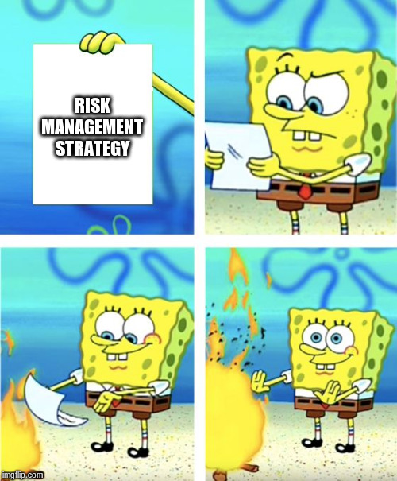
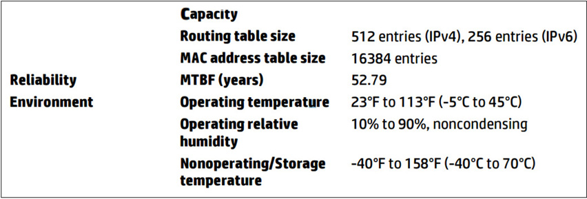
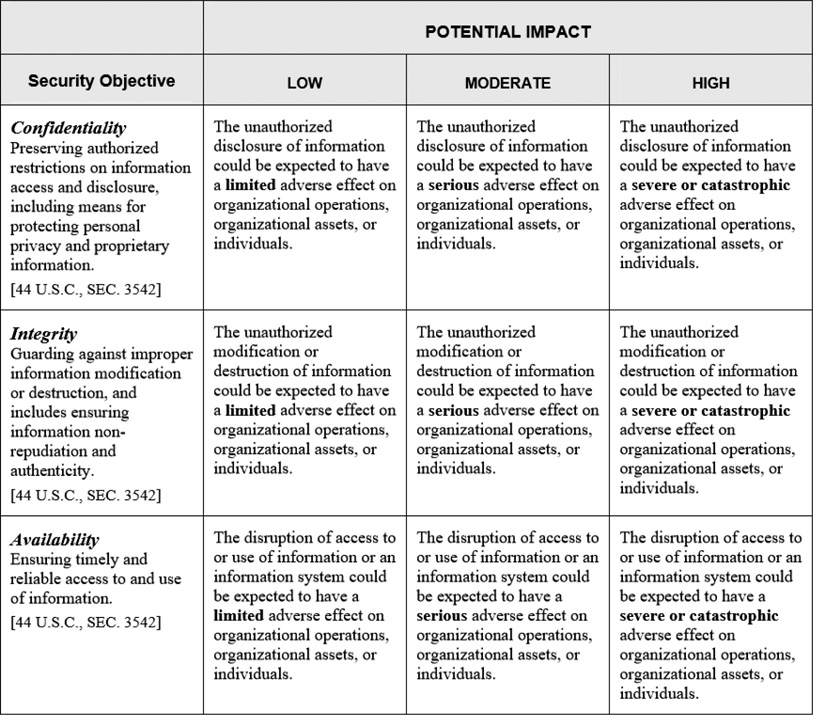
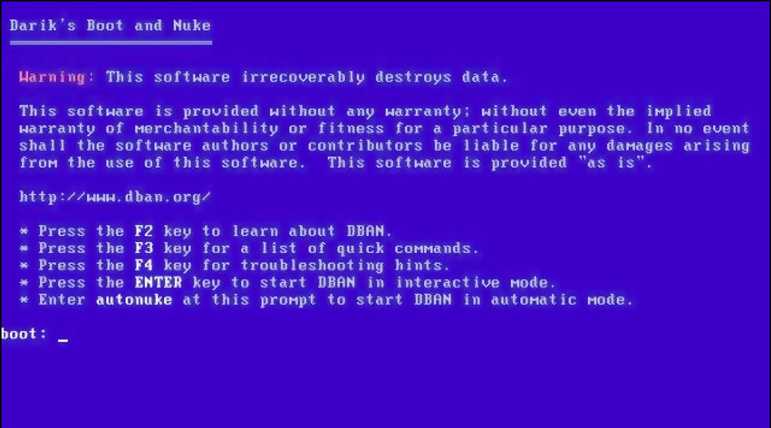

# Sec+ lunch & learn



## Risk Management

Risk management is the science of identifying and categorizing risks and then systematically applying resources to these risks to minimize their impact on an organization.
Risk is the probability of a threat actor taking advantage of a vulnerability by using a threat against an IT system asset. The follow concepts are used to deduce risk.

### Defining Risk

#### Asset

Things like servers, applications, data and even personnel.

#### Probability

Probability means the likelihood—over a defined period of time—of someone or something damaging assets.

#### Threat Actor

Hacktivists, Script kiddies, Insiders, Competitors, Organized crime, Nation state/APT. There is also the possibility of unintended insider threats such as employees deleting a DB,
so unnecesarily elevated permissions can be viewed as a vulnerability.

#### Vulnerability and Threat

The terms vulnerability and threat go hand-in-hand, so it makes sense to talk about both at the same time. A vulnerability is a weakness inherent in an asset that leaves it open to a threat. A threat is an action a threat actor can use against a vulnerability to create a negative effect. You can’t have a threat without a vulnerability. Not changing the default password on a router is a vulnerability; someone taking control of your router by using the default password is the threat.

#### The Risk “Formula”

Risk = Probability × Vulnerability × Threat.  Impact is the effect of an attack on a single asset. Impact is measured in different ways, such as financial (value, repair), life (as in human lives), and reputation (good will, mentioned earlier).

Risk of meteor threat = (very low probability) × (high impact)

Given the very low likelihood of a meteor impact, you won’t try to reduce your vulnerability to this threat

Risk = Probability × Impact

Malware from e-mail is a huge problem, but generally not very hard to clean up, so:

Risk of malware through e-mail = (very high probability) × (moderate impact)

### Risk Management Concepts

#### Infrastructure

In IT risk management, the term infrastructure applies to just about every aspect of an organization, from the organization itself to its computers, networks, employees, physical security, and sometimes third-party access.

* Organization: At its most basic, an organization is who you work for: your company, your corporation, your non-profit, your governmental department, your team.
* Systems: People matter, such as IT managers, IT techs, human resources, governance (chief security officer, chief information officer), and legal staff; even individual users are part of the IT infrastructure.
* Physical Security: Fences, cameras, and guards protect your infrastructure just as well as they protect the rest of your organization.
* Third-Party Access: Third parties that your organization contracts with are part of your IT infrastructure.

#### Security Controls

A security control is a directed action you place on some part of your infrastructure. Account password complexity enforcement is a security control.

#### Risk Management Framework

Easily the most popular RMF available comes from the National Institute of Standards and Technology (NIST). Other considerations for your risk management framework
are Laws such as HIPAA and GDPR, and Standards such as PCI-DSS for mitigating CC fraud.

Another importat aspect of an RMF is the security policies of the org. A basic example is `Users must not attempt to access any data, documents, e-mail correspondence, and programs contained on systems for which they do not have authorization.`.


### Security Controls

#### Phase Controls

It’s helpful to categorize security controls based on when they work relative to the phase of an attack.

* A deterrent control is designed to deter a potential attacker from even attempting an attack.


* A detective control works during an attack. As the name implies, these controls actively look for an attack and alert security professionals to the presence of an active, ongoing attack. An IDS or SIEM is one such deterrent.
* A corrective control applies after an attack has taken place and fixes/mitigates the result of the incident.
* Sometimes you need to provide a temporary solution to a vulnerability that’s less than optimal. You use compensating controls to keep going until a better control is available or possible.
* A preventative control attempts to keep an active attack from succeeding. The earlier example of using a 20-character password on WPA2 is a great example of a preventative control.

#### Control Types

* Technical controls are security controls applied to technology.
* Administrative controls are applied to people.
* Physical controls are applied to secure physical areas from physical access by unauthorized people.

#### Security Control Strategies

##### Defense in Depth/Layered Security

Every IT infrastructure might be looked at as a series of concentric shells. For example, below we have layered security for a physical control.


Doing the same exercise, we have layered technical controls for network intrusion.


##### Vendor diversity

When IT professionals find a vendor they like and know, they tend to stick with that vendor. While using a single vendor has conveniences, it also creates a single point of failure that needs to be considered.

##### Control diversity

Control diversity means to combine different types of controls to provide better security. A password policy is an example of technical and admin controls.

##### User training

User training covers critical issues such as password usage, personal security, and, probably most importantly, the ability to recognize attacks.

## Module 1-4: Risk Assessment

### Concepts of Risk Assessment

#### Risk assessment methodology

The Risk IT Framework by NIST provides a way to do assessments. However, its strongly encouraged that orgs hire IT risk specialists.

1. Prepare for assessment.
2. Conduct assessment:
    * Identify threat sources and events.
    * Identify vulnerabilities and predisposing conditions.
    * Determine likelihood of occurrence.
    * Determine magnitude of impact.
    * Determine risk.
3. Communicate results.
4. Maintain assessment.

##### Identifying Threat Sources/Events

The first step in threat assessment is to identify the threat sources and to categorize them into groups.


As a baseline, use the follow sources:

 * Environmental     Natural disasters outside the control of humans

 * Manmade     Any threat that is not environmental

* Internal     Threat generated by internal sources, usually an insider to the organization

* External     Threat generated from outside your infrastructure

##### Likelihood and impact

Once you have collected all the different data on threats, vulnerabilities, and assets, you can assess likelihood of occurrence and impact. Likelihood of occurrence is the probability that a threat actor will initiate a threat or the probability that a threat could successfully exploit a given vulnerability. Impact is the degree of harm or damage caused to an asset or the organization.


### Quantitative Assessment

There two ways to perform a risk assessment. A quantitative risk assessment is based on objective data—typically, numerical data. A quantitative assessment is objective in that the data fed into it is measurable and independently verifiable. For example, cost expressed as a dollar value is a measurable and concrete piece of data often used to perform quantitative analysis. Other types of numerical data may include statistical analysis of different aspects of likelihood, for instance.

#### Asset Value & Exposure factor

The asset’s value is the first data on which to perform a quantitative analysis. It's not as simple as the replacement cost of the asset, however, but rather also the revenue it generates, and which will be lost temporarily. It’s not only about the cost of replacement for the asset itself, but also how much value it gives to the organization.

Another factor you should consider with asset valuation is the exposure factor, the percentage of an asset that could be lost during a negative event. Realistically, you will not always lose 100 percent of the asset

#### Single loss expectancy

The single loss expectancy (SLE) is a value that’s computed simply by multiplying the asset’s value (in dollars) by the exposure factor (percentage of loss).  You might use statistical analysis, or even the “best guess” by a committee of experts, to determine exposure factor for different assets.

SLE (single loss expectancy) = AV (asset value) × EF (exposure factor)

#### Annualized rate of occurence

The annualized rate of occurrence (ARO) is how many times per year you would expect a particularly negative event to occur, resulting in a loss of the asset. This value relates more to likelihood than impact and serves to establish a baseline of how likely a specific threat is to occur, affecting the asset.

For instance, obtaining the ARO for attacks from hackers would be problematic, since that would not necessarily be limited to a geographical area. You might have to gather data and perform statistical analysis to determine how often serious attacks occur, given specific circumstances, attack methods, level of attack, and so on, with regard to your type of industry or business. Oftentimes it seems like a bit of guesswork.

### Annualized loss expectancy

The annualized loss expectancy (ALE) essentially looks at the amount of loss from the SLE and determines how much loss the organization could realistically expect in a one-year period.

Example:

The Bayland Widget corporation has a data center in Totoville, Kansas. Totoville averages about seven major tornados a year. The ARO of a tornado is therefore 7. A serious tornado hit to the $2,000,000 facility would likely cause about 20 percent damage. Put those numbers together to create the SLE:

SLE = AV ($2,000,000) × EF (20% or 0.2)
SLE = $400,000

If all seven major tornadoes that occurred during the year actually hit and caused this level of damage to the facility, then the ALE would be $400,000 (SLE) × 7 (ARO) = a potential loss of $2,800,000 (ALE). This would be the worst-case scenario. Realistically, since all seven are not likely to hit the facility, you can lower the ARO to a lesser number.

These simple formulas don’t take into account realistic values or other risk factors that may affect likelihood and impact

### Qualitative assessment


Quantitative risk assessments seem to be, on the surface, the way to go if an organization wants a very accurate, data-driven view of risk. Quantitative analysis, however, has a couple of weak points. First, a lack of data can force organizations to use incomplete or subjective numerical values. Second, even exact numbers can be misleading, simply because of the different methods people and organizations use to arrive at numerical values. Yet another issue is the fact that even when you’re talking about exact numbers, they can still be subjective. People, because of their own opinions or limitations of their data collection and analysis processes, sometimes have to make educated guesses about numerical values. These issues can cause data to be incomplete, inexact, or simply incorrect. Another big shortfall with quantitative analysis is that many other types of data cannot be easily quantified or measured. Some of these pieces of data are also subjective. In other words, they are dependent upon the point of view of the person collecting and analyzing the data. This is why a qualitative analysis is often preferred.

Most organizations use a combination of qualitative and quantitative analysis. To calculate the impact, for example, the organization might use quantitative assessments. To calculate likelihood, they may go with a qualitative approach.

Putting It All Together: Determining Risk

### Risk Response

After you’ve identified and analyzed risk for assets and the organization, you must then decide how to respond to the risks produced as a result of the analysis. Responding to risk means to attempt to minimize its effects on the organization. Risk response techniques fall into four categories:

* Risk mitigation is an attempt to reduce risk, or at least minimize its effects on an asset. This may mean reducing the likelihood of occurrence, reducing or eliminating the exposure of the vulnerability, or reducing the impact if a negative event does occur. Mitigation usually involves adding security controls to protect an asset against a threat, reducing likelihood, exposure, or impact in some way. Keep in mind that risk can never be fully eliminated.

* Risk transference (also sometimes called risk sharing) deals with risk by sharing the burden of the risk. An example of risk sharing is buying insurance, which in turn reduces the impact. Another example of risk sharing using 3rd party providers. A caveat about this is: Transferring risk does not also mean transferring legal responsibility or liability from the organization. Ultimately, the responsibility for protecting data and following legal governance still belongs to the organization.

* Risk acceptance means the organization has implemented controls and some risk remains. It does not mean simply accepting an identified risk without taking any action to reduce its effects on the organization. Risk acceptance isn’t the act of ignoring risk. Residual risk is what remains after a firm has reduced the risk and impact to acceptable levels.

* Risk avoidance means that the organization could choose not to participate in activities that cause unnecessary or excessive risk. Note that this doesn’t mean that the risk is ignored and that the organization does not take steps to reduce it. In some cases, a business pursuit or activity may be too risky to undertake, for example.

Often, an organization will use a combination of these responses to address the many and varied risks it encounters; there is no one perfect response solution that fits all organizations, assets, and activities. The decision of how to respond to a particular risk scenario involves many complex factors, which include cost, effectiveness of the response, value of the asset, and the ability of the organization to implement a particular response successfully.

## Business Impact Analysis

A business impact analysis (BIA) predicts both the consequences of incidents and the time and resources needed to recover from incidents. NIST offers another template for perofrming a BIA:

1. Determine mission/business processes and recovery criticality. Mission/Business processes supported by the system are identified and the impact of a system disruption to those processes is determined along with outage impacts and estimated downtime.

Make sure you know which workflows and processes your organization depends on to operate, in other words, the mission-essential functions. Determine the types of impact and consider the impact of the failure of each of these workflows and processes. Estimate how long it takes to bring those workflows and processes up to speed.

2. Identify resource requirements. Realistic recovery efforts require a thorough evaluation of the resources required to resume mission/business processes and related interdependencies as quickly as possible.

What are the critical tools your organization uses to do these workflows and processes? Where are they? How do they work? In other words, a BIA provides identification of critical systems.

3. Identify recovery priorities for system resources. Based upon the results from the previous activities, system resources can be linked more clearly to critical mission/business processes and functions. Priority levels can be established for sequencing recovery activities and resources.

Once you understand all the resources that together make a particular workflow/process work, determine the priority of bringing them back up to speed if they fail.

### Types of Impact

* Financial
* Reputation
* Property
* Safety/life
* Privacy

### Locating critical resources

For example, our internet access relies on 4 basic resources, with several single points of failure:

* Cable modem Add a second ISP into the mix. This could act as a failover if the primary ISP fails.

* Edge router Cisco produces very reliable routers, but a quick check of the Cisco Web site shows the router model used by Totalsem accepts dual power supplies. This will help increase the MTBF (see the next section) significantly.

* DNS server A single DNS server is never a good idea. Totalsem could add a second DNS server or create a secondary lookup zone on a cloud server.

* NAT router Totalsem uses a low-quality router, but has spares ready to go. There will be a time impact to install the replacement, but having the spare onsite is far better than running to the store.

### Calculating Impact

In the context of hardware, the exam touches on 3 qualitative factors to calculate business impact:

* MTBF Mean time between failures (of one major component). Typically time between repairs of a major component failure.
* MTTF: Mean time to failure (length of time device expected to operate). Typically time between replacement of entire device.
* MTTR: Mean time to recovery.



### Calculating downtime

The RTO and RPO help IT professionals calculate how much an organization can or will lose if a system goes down before backup systems can be brought online.

* Recovery time objective (RTO) is the maximum amount of time that a resource may remain unavailable before an unacceptable impact on other system resources occurs
* Recovery point objective (RPO) defines the amount of time that will pass between an incident and recovery from backup.

If a company backed up yesterday, for example, the RPO is 24 hours.

## Data security and privacy policies

### Data organization and sensitivty

The first step to dealing with data security is organization. Analyze individual chunks of data, such as databases, spreadsheets, access control lists, and so on. Then determine the importance—the sensitivity—of that data. After accomplishing both tasks, sort the data into different classifications based on sensitivity. These classifications help security professionals to determine the amount of security control to apply to each data set.

One way to consider sensitivity is by the impact of an incident that exposes the data:



### Data labeling

Confidential, private, proprietary, public or internet, internal use, restricted, sensitive as an example of custom labels.

### Data roles

Data Owner   The data owner is the entity who holds the legal ownership of a data set. This includes any copyrights, trademarks, or other legal possession items that tie the data set to the entity. The data owner can rent, sell, or give away the data set as the owner sees fit. Data owners are almost always the organization itself and not an actual person. This entity has complete control over the data and will delegate responsibility for the management of that data set to persons or groups to handle the real work on that data.

Data Custodian   A data custodian ensures that the technical aspects of the data set are in good order. Data custodians are the folks who make sure the data is secure, available, and accurate. They audit the data and ensure they have both the appropriate storage capacity and proper backups.

Data Steward   A data steward makes sure that the data set does what the data is supposed to do for the organization. Data stewards interface with the users of the organization to cover data requirements, to define the metadata, and to make sure the data ties to company or industry standards. Data stewards update the data as needed to conform to needs. Data stewards also define how users access the data.

Privacy Officer   When an organization has data that is subject to privacy laws and regulations (a big issue here in the United States), it will assign a privacy officer to oversee that data. Privacy officers perform the due diligence to make sure that the data’s storage, retention, and use conform to any and all laws and regulations. We’ll see more of this person in the next section.

### Legal & compliance

Most countries have laws, regulations, and standards designed to protect different forms of data. As introduced in Module 1-2, in the United States, the Health Insurance Portability and Accountability Act (HIPAA), PIPEDA in Canada, and PCI-DSS for credit cards.

### Personally identifiable information

* Name, such as full name, maiden name, mother’s maiden name, or alias

* Personal identification numbers, such as Social Security number (SSN), passport number, driver’s license number, taxpayer identification number, or financial account or credit card number

* Address information, such as street address or e-mail address

* Personal characteristics, including photographic image (especially of face or other identifying characteristic), fingerprints, handwriting, or other biometric data (e.g., retina scan, voice signature, facial geometry)

* Information about an individual that is linked or linkable to one of the above (e.g., date of birth, place of birth, race, religion, weight, activities, geographical indicators, employment information, medical information, education information, financial information)

### Protected health information

(PHI) is any form of personal health information (treatment, diagnosis, prescriptions, etc.) electronically stored or transmitted by any health provider, insurer, or employer. This health information must be tied to the individual’s PII to be considered PHI. In other words, a blood pressure reading combined with age and race is alone not PHI. A blood pressure reading combined with a name or an address or SSN is PHI.

### Data retention

In the US, The Sarbanes-Oxley Act is easily the most far-reaching law affecting the types of data public companies must retain and the length of time they must retain that data:

```Whoever knowingly alters, destroys, mutilates, conceals, covers up, falsifies, or makes a false entry in any record, document, or tangible object with the intent to impede, obstruct, or influence the investigation … shall be fined under this title, imprisoned not more than 20 years, or both.```

```Any accountant who conducts an audit of an issuer of securities … shall maintain all audit or review workpapers for a period of 5 years from the end of the fiscal period in which the audit or review was concluded.```

### Data destruction

Stored data fits into one of two categories: legacy media (paper, film, tape, etc.) or electronic media (hard drives, SD cards, optical media, etc.). Each of these categories have different methods for data destruction.

For legacy media, destroy it through burning or pulping.

For electronic media, formatting is not enough to evade forensics. There are specialized programs, but to be certain you need to degauss with an electromagent and then pulverize or shred.




The exam has a whole chapter on data sanitizing.

